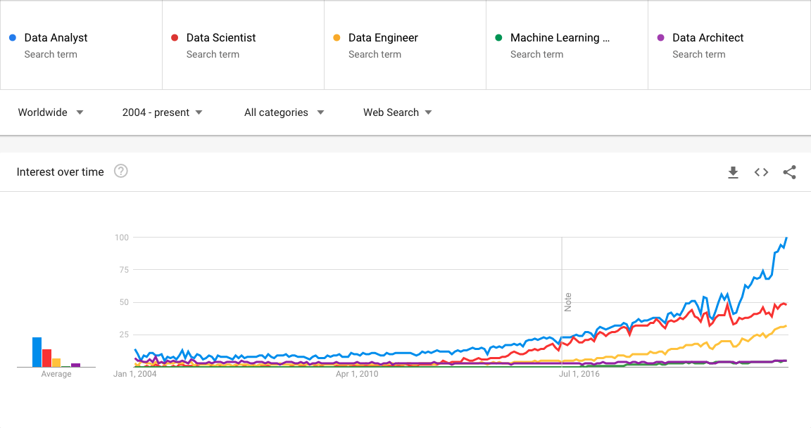

# Data Career Pathways

We start the design of a career ladder by specifying which data careers will be
 present on the document. The number of data specialties, or career paths, on a
career ladder will depend a lot on the company size and its analytical acumen.
Besides, the data field is still maturing, new job titles and descriptions
are surging while others fade away, making this specification more challenging.
Nonetheless, knowing that we are aiming at a moving target, it is possible to
identify a few data career names that should at least be considered when designing
a data career ladder.

## Finding the suspects

To have a general sense of the relevance of a job title, we will start by
using [Google Trends](https://trends.google.com/) to get a sense of
how popular some data job titles are. When writing this document,
the following job titles were assessed: AI Developer, Analytics Engineer,
Business Intelligence Analyst, Business Intelligence Developer, Data Analyst,
Data Architect, Data Engineer, Data Scientist, Machine Learning Engineer.

The tool only allows for up to five search terms to be displayed concurrently, the
graph above shows the results for the five most popular terms.
